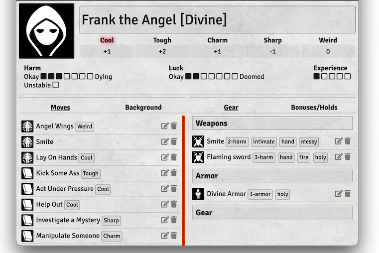
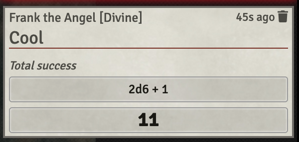
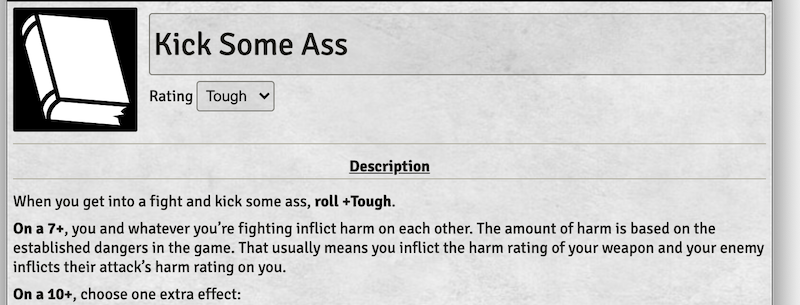
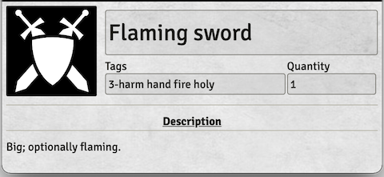

# Monster of the Week

A simple, unofficial [Foundry VTT](https://foundryvtt.com/) system for
[Evil Hat Productions](https://www.evilhat.com/)'s [Monster of the
Week](https://www.evilhat.com/home/monster-of-the-week/). Created with
permission from the publisher.

## Installing

In your Foundry VTT instance:

- Enter "Setup" mode
- Go to the "Game Systems" tab
- Click "Install System"
- In the "Filter Packages" field in the upper right, search for "Monster/Week"
- Click "Install" on the entry that shows up

See https://foundryvtt.com/packages/monsterweek/ for details about the Foundry package.

## Overview

Includes:

- Basic hunter/move/gear sheets
- Rollable ratings: click on the Cool/Tough/Charm/etc. header on the hunter
  sheet to see the roll in the chat window, with a header for "total success",
  "mixed success", or "failure".

Doesn't include:

- A compendium of moves, basic or otherwise
- Ways to represent hunter-specific concepts like
  the Pararomantic's "Relationship status" track, the Hex's Rotes, or
  the Spell-Slinger's spells
    - You could use "Gear" entries to represent rotes/spells
    - Relationship status or other similar things could live as freeform text
      in the Background or Bonuses/Holds tabs.

Not a lot, but enough to get a game going. Feel free to file issues, or send
pull requests or translations! This is my first javascript thing, so I'll do
my best. :)

This system is released under the MIT license described in
[LICENSE.txt](LICENSE.txt), and its copyright belongs to its contributors.

Some text and concepts included in this system may be copyright [Evil Hat
Productions](https://www.evilhat.com/).

Forked from the [Simple Worldbuilding
System](https://gitlab.com/foundrynet/worldbuilding).

## Screenshots

### Hunter

Create by creating an actor, and choosing "hunter" as the type.

To change the value of a rating ("Cool", "Tough", etc.), type in the number and
hit enter. Rating values are restricted to the range from -1 to +3 based on the
rules.

To roll, click the rating word ("Cool", etc.) at the top of the sheet. The
chat message will tell you what kind of success/failure it was.

Increase or decrease marks on the Harm/Luck/etc. tracks by clicking on the left
or right ends; no need to click on exactly the next box, though that works too.

The "Background" and "Bonuses/Holds" tabs are freeform text, for keeping track
of stuff that isn't fully supported by the system.

### Move

Create by using the "+" icon in the header of the Moves list on the Hunter
sheet, or creating a new item in the "Items" chat tab and selecting "move" as
the type.

If the move typically requires rolling a specific rating, you can select it in
the drop-down at the top, and it will appear as a chip on the hunter sheet.

Those chips do not currently trigger a roll, but they let you know which rating
to roll without needing to open the move.

### Gear/Weapon/Armor

Create by using the "+" icon in the headers of the Weapons/Armor/Gear sections
on the Hunter sheet, or creating a new item in the "Items" chat tab and
selecting "weapon"/"armor"/"gear" as the type.

Tags are space-separated, and will appear as chips on the hunter
sheet.

## Future features

- Fonts:
  - The book uses https://www.myfonts.com/fonts/protype/lavah-pro/grunge/
    - Similar free fonts: https://www.dafont.com/theme.php?cat=107
  - Handwriting fonts for the ratings values:
    https://www.dafont.com/theme.php?cat=605&text=%2B1+-2+%2B3+0
  - Typewriter fonts for names:
    https://www.dafont.com/theme.php?cat=113&text=Kick+Some+Ass
  - Copy text in the book:
    https://www.myfonts.com/fonts/adobe/warnock/bold-capt/
    - https://www.dafont.com/sling.font
    - https://www.dafont.com/isle-body.font
- Luck:
  - Add a spot for the hunter luck rules; maybe pop it up when clicking
    the "Luck" label. E.g., "Crooked special: Whenever you spend a Luck point,
    someone from your past will re-appear in your life. Soon."
    (See "updated luck rules" playbooks at
    https://www.evilhat.com/home/monster-of-the-week-resources/)
- Moves:
  - Structure the 10+/7-9/fail text so it can be displayed in chat
  - Would be cool to automatically add holds, though that could get
    annoying if most of the holds are used immediately; may be better
    to do it in chat with a button to remember the hold for later.
  - Some gear can provide custom moves. Would be nice if owning that gear
    added the move to the owner's list.
  - Leveling up can change basic moves to Advanced Moves (p122) which gives
    them extra effects on 12+.
- Hunter specials
  - The Hex's Rotes (spells). Could treat them as special
    moves, since they follow from Use Magic, or could create a new type
    of thing for them. Could still appear in the Moves tab, just under
    a Rotes section
  - Pararomantic's "Relationship status" track
  - Spell-slinger has spells with tags, and some provide both harm and
    armor. A new category beyond armor/weapon/gear? Or do we mix them
    all together and maybe cluster by "magic", "#-harm", "#-armor", etc.
- Armor
  - Would be nice to roll up all armor into a single top-level view,
    adding all N-armor and highlight tags like 'magic'. Clicking on it
    would switch to the gear/armor tab.
- Misc
  - Big "DOOMED" stamp across avatar when luck is completely full
